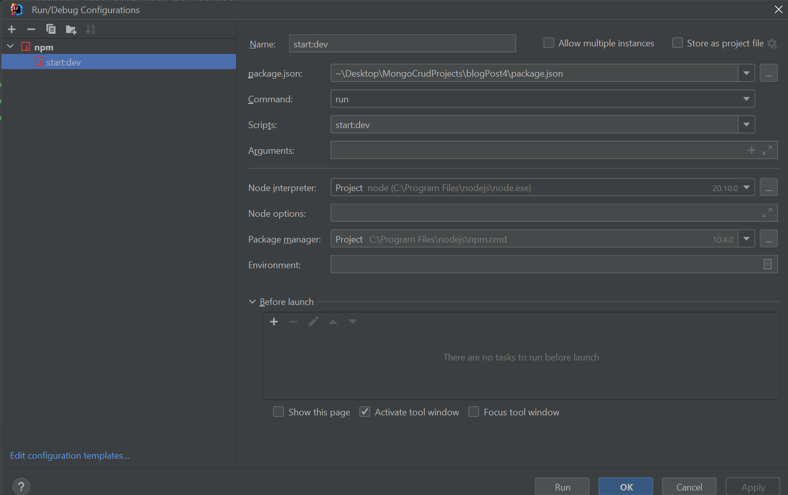

# BLOG POSTS API


## Used technologies

- Node.js
- TypeScript
- Express
- MongoDB

## Concepts used

- SOLID
- Dependency Injection
- Repository Pattern

## Entities

<pre>
BlogPost {
  title: string;
  lastName: string;
  author: string;
  content: string;
  tags: string;
}</pre>

<pre>
TotalNumberByAuthor {
  author: string;
  totalNumber:number;
}</pre>

## Routes

- GET /blogposts - return all blogs posts
- POST /blogposts - create blog post
- PATCH /blogposts/:id - update blog post
- DELETE /blogposts/:id - delete blog post
- GET /totalblogposts/:author - get total number blog posts


## Installation
```sh
# Clone the repository

# Install project dependencies
  yarn add  install

# Running the project in the development environment
  yarn start:dev
```

# Uploading the database with docker
docker compose up -d

# Removes all containers and their components
docker-compose down
```
# Node.js Version
v20.10.0.

#Import it from postman (I sent this collection)
#you can just run them from postman. Paramers are ready to run.


